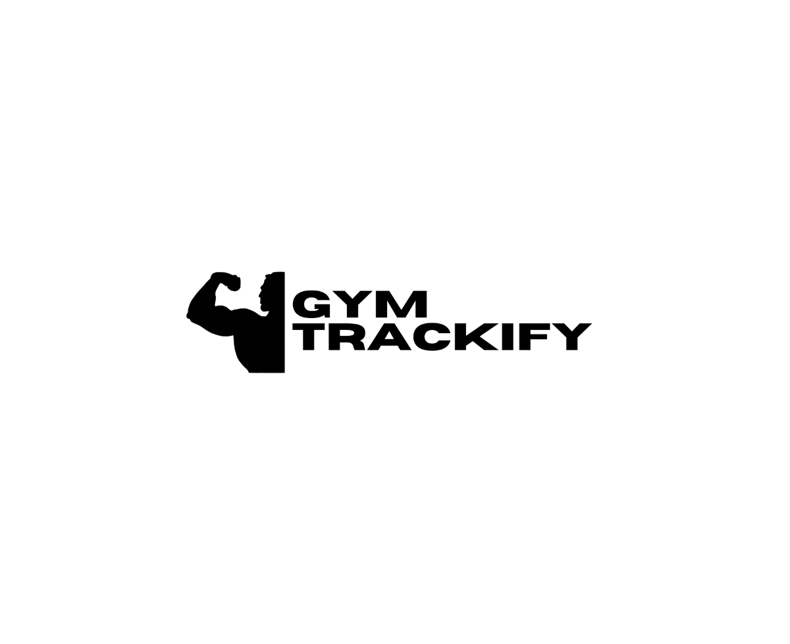

## `1º` **|** GYM TRACKIFY 🏋️‍♂️🔥 

O GymTrackify é um projeto desenvolvido com o objetivo de facilitar o registro e acompanhamento de treinos de forma simples, organizada e eficiente.
A proposta é permitir que o usuário tenha controle sobre seus exercícios, cargas, repetições e evolução ao longo do tempo, ajudando a 
manter consistência e disciplina. Além disso, o projeto busca incentivar hábitos saudáveis e a melhoria contínua, 
tornando o acompanhamento do progresso algo prático e acessível no dia a dia.

## `2º` **|** Funcionalidades ⚙
- Registro de treinos diários
- Controle de exercícios (nome, peso, reps)
- Acompanhamento de evolução
- Organização semanal de treino
